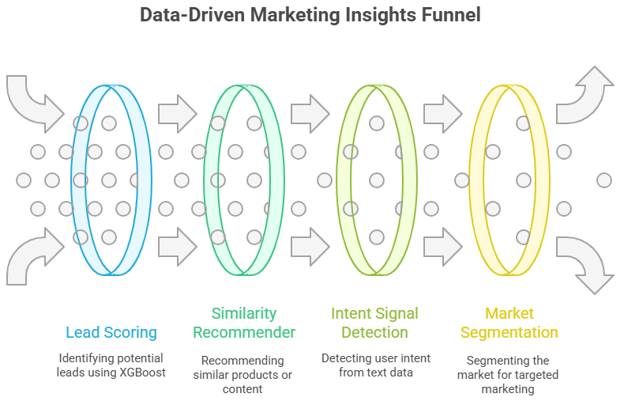
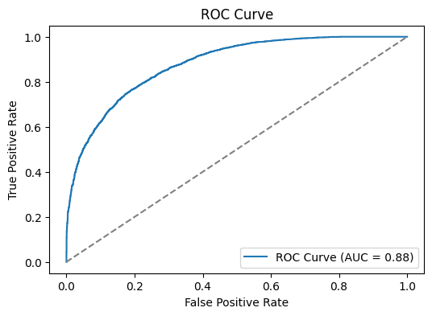
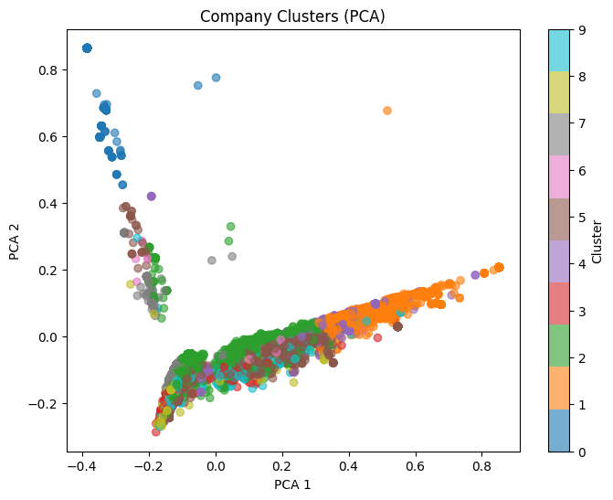
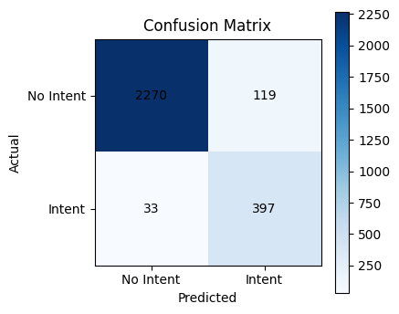

# SaaSquatch-AI-Leads: End-to-End AI-Driven Lead Intelligence Platform

## Executive Summary

SaaSquatch-AI-Leads is a modular, production-grade AI platform for automated lead scoring, segmentation, and intent detection, purpose-built for SaaS and B2B sales enablement. Leveraging the Crunchbase startup dataset, the solution integrates advanced supervised and unsupervised machine learning, natural language processing, and scalable data engineering pipelines. The system is implemented in Python with a Streamlit-based UI, supporting rapid experimentation and deployment.

## Data Engineering & Feature Synthesis

- **Dataset:** [Crunchbase Startup Investments (Kaggle)](https://www.kaggle.com/datasets/arindam235/startup-investments-crunchbase/data)
- **ETL Pipeline:** Automated ingestion, deduplication, imputation of missing values, and normalization of categorical and numerical attributes.
- **Feature Synthesis:**  
  - Temporal features: company age, time since last funding, time to first funding.
  - Funding vectorization: one-hot encoding of funding rounds, aggregation of funding totals.
  - Textual features: concatenation and TF-IDF vectorization of `category_list`, `market`, and company descriptions.
  - Synthetic targets:  
    - **Lead conversion:** Binary label (`converted = funding_total_usd > $1M`)
    - **Intent signal:** Regex/keyword-based label for commercial intent.

## Model Architecture & Rationale

- **Lead Scoring:**  
  - **Algorithm:** XGBoost Classifier (gradient-boosted decision trees)
  - **Justification:** Handles high-cardinality categorical variables, missing data, and non-linear feature interactions; provides feature importance for model interpretability.
- **Similarity Recommender:**  
  - **Algorithm:** TF-IDF vectorization + Cosine Similarity
  - **Justification:** Efficient for high-dimensional sparse text; enables semantic search and clustering.
- **Intent Signal Detection:**  
  - **Algorithm:** TF-IDF (1-2 grams) + Logistic Regression (class_weight='balanced')
  - **Justification:** Robust to class imbalance, interpretable coefficients, and scalable for large corpora; SMOTE applied for oversampling in analysis.
- **Market Segmentation:**  
  - **Algorithm:** KMeans clustering on TF-IDF embeddings
  - **Justification:** Unsupervised segmentation for market discovery and persona targeting; dimensionality reduction via PCA for visualization.

## Evaluation & Validation

- **Lead Scoring:** ROC AUC ≈ 0.88, Accuracy ≈ 0.79 (stratified holdout, ROC, feature importances)
- **Intent Detection:** ROC AUC ≈ 0.98, Accuracy ≈ 0.95 (confusion matrix, ROC)
- **Clustering:** PCA visualization confirms meaningful, non-random clusters aligned with market verticals.
- **Similarity:** Qualitative validation; nearest neighbors are contextually and semantically relevant.

## System Design & Deployment

- **Architecture:** Modular codebase with separation of concerns (preprocessing, modeling, inference, UI).
- **Model Persistence:** All models and vectorizers serialized with joblib for reproducibility and portability.
- **UI/UX:** Streamlit app with multi-tab navigation for lead scoring, similarity search, segmentation, and intent analysis.
- **Scalability:** Designed for batch and real-time inference; can be containerized for cloud deployment.

## Business Impact

- Enables data-driven lead prioritization, market segmentation, and sales targeting.
- Reduces manual prospecting effort and increases conversion rates through predictive analytics and NLP-driven insights.

## Repository

- **GitHub:** [https://github.com/veydantkatyal/leads-tool-ai](https://github.com/veydantkatyal/leads-tool-ai) 
